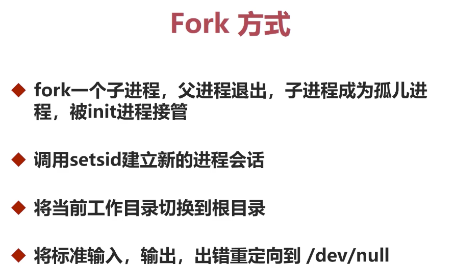

# daemon
fork进程4部曲


```
➜  daemon git:(master) ✗ ps -ef | grep testdaemon
  501 50019     1   0  8:52PM ??         0:00.00 ./testdaemon
  501 50040 41892   0  8:52PM ttys001    0:00.00 grep --color=auto testdaemon
➜  daemon git:(master) ✗ kill -9 50019
➜  daemon git:(master) ✗ ps -ef | grep testdaemon
  501 50065 41892   0  8:52PM ttys001    0:00.00 grep --color=auto testdaemon
```
